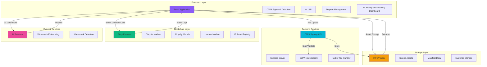
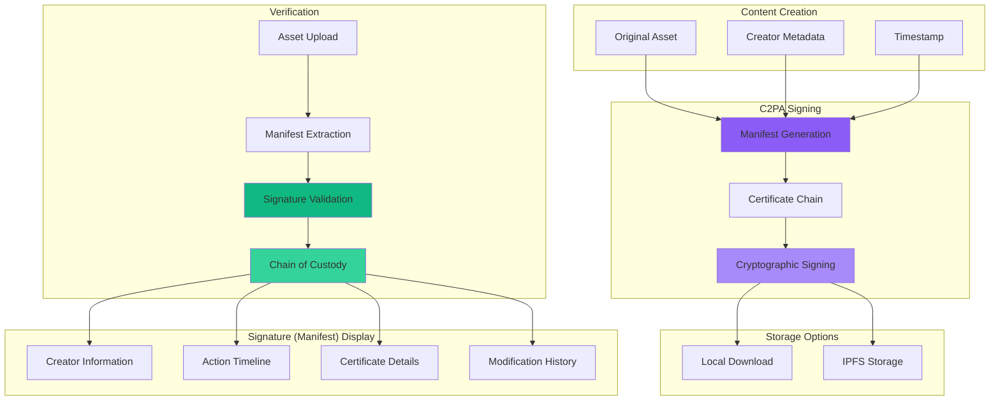
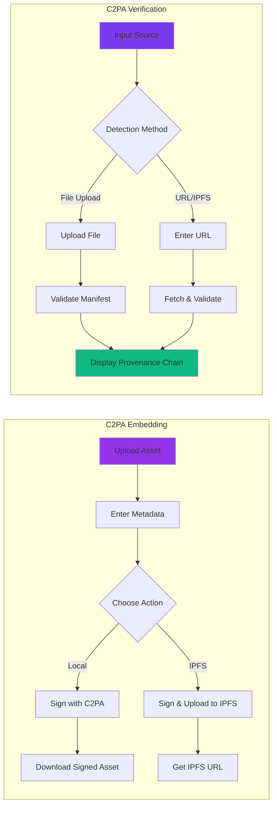
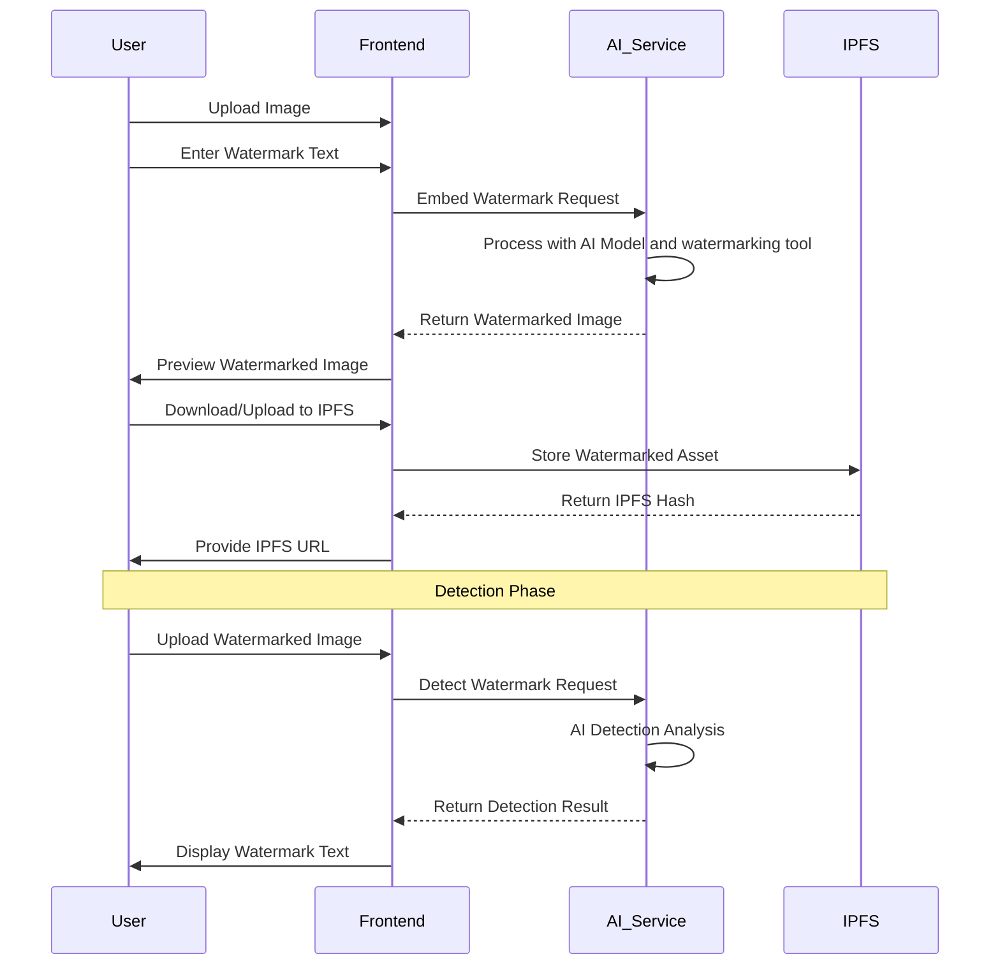
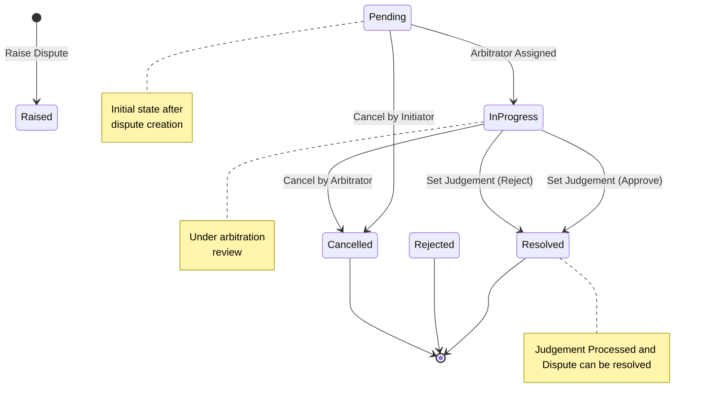
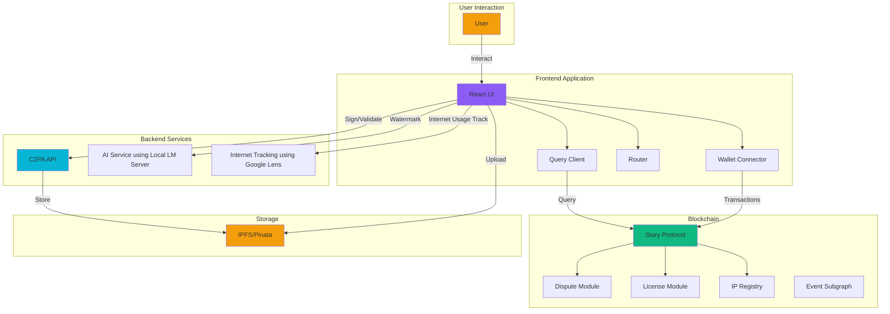

# SentryMark

### Mark. Monitor. Enforce

**A Comprehensive Application for Intellectual Property Asset Management, Tracking, and Enforcement**

## Table of Contents

- [Overview](#overview)
- [Architecture](#architecture)
- [Core Features](#core-features)
  - [1. C2PA Manifest Embeding and Detection](#1-provenance-tracking-c2pa)
  - [2. AI Watermark Protection](#2-ai-watermark-protection)
  - [3. Dispute Management System](#3-dispute-management-system)
  - [4. On-Chain IP Info and Internet Tracking](#4-on-chain-ip-history-tracking)
- [Technology Stack](#technology-stack)
- [System Architecture](#system-architecture)
- [Installation](#installation)
- [Configuration](#configuration)
- [API Documentation](#api-documentation)
- [Smart Contract Integration](#smart-contract-integration)
- [Development](#development)
- [Contributing](#contributing)
- [License](#license)

---

## Overview

SentryMark is an advanced decentralized application (Dapp) built to protect, track, and enforce intellectual property rights using blockchain technology, C2PA standards, AI-powered watermarking, and comprehensive dispute management systems. The platform provides creators, artists, and IP owners with tools to secure their digital assets, monitor unauthorized usage on the internet, and resolve disputes through a transparent blockchain-based system.

### Key Objectives

- **C2PA Enforcement**: Implement industry-standard C2PA (Coalition for Content Provenance and Authenticity) for cryptographic proof of content origin, ownership, and modification history (images, audios, videos, documents, etc)
- **AI Asset Protection**: Utilize AI-powered invisible watermarking to protect digital content from unauthorized use and enable ownership verification
- **Dispute Resolution**: Provide a transparent blockchain-based dispute management system with decentralized arbitration and on-chain resolution
- **IP Management**: Track complete intellectual property asset lifecycle on Story Aeneid Protocol blockchain with immutable records (creator, revenue generated, infringements, associated licenses, traits, internet tracking, lifecycle)
- **Decentralized Storage**: Leverage IPFS for distributed, censorship-resistant, and immutable asset storage with content addressing

---

## Architecture



---

## Core Features

### 1. C2PA Manifest Embeding and Detection

A comprehensive content authenticity and IP tracking system implementing C2PA (Coalition for Content Provenance and Authenticity) standards. This feature provides cryptographic proof of content origin, ownership, and modification history, ensuring digital assets maintain verifiable authenticity throughout their lifecycle.

#### C2PA Architecture



#### Feature Flow Diagram



#### Core Capabilities

**C2PA Embedding**
- **Cryptographic Signing**: Asset signing with certificate-based cryptographic proof for media that doesn't have a manifest (already signed manifest throw error - Media already signed)
- **Multi-Format Support**: 
  - Images: JPEG, PNG, GIF, WebP
  - Audio: MP3, WAV
  - Video: MP4, MOV
- **Rich Metadata**: 
  - Title and creator information
  - Creation timestamp
  - Software agent identification
  - Custom assertions support
- **Flexible Output**:
  - Local download of signed assets
  - Direct IPFS upload with gateway URL Option
  - Automatic filename generation
- **Certificate Standards**:
  - ES256 (ECDSA with P-256 and SHA-256) algorithm
  - X.509 certificate chain validation
  - Support for self-signed certificates (development)

**C2PA Manifest Verification**
- **Multi-Source Detection**:
  - Direct file upload from local storage
  - IPFS URLs (ipfs:// protocol or gateway URLs)
  - HTTP/HTTPS web URLs
  - Automatic URL normalization
- **Comprehensive Chain of Custody**:
  - Creator and ownership information
  - Complete action timeline with timestamps
  - Signature verification status
  - Certificate chain validation
  - Claim generator identification
- **Validation Reporting**:
  - Visual validation status indicators
  - Detailed error and warning messages
  - Partial validation support
  - Embedded vs. external manifest detection
- **C2PA Manifest Data Display**:
  - Manifest information panel
  - Creator details with verification
  - Chronological action timeline
  - Signature and certificate information
  - Instance ID and label tracking

#### Technical Implementation

**Backend Architecture (Node.js + Express)**

Signing Endpoint:
```
POST /api/sign
├── Input: FormData with file, title, creator, claimGenerator
├── Process:
│   ├── File validation and type detection
│   ├── Manifest JSON generation
│   ├── Assertion creation (actions, CreativeWork)
│   ├── Certificate chain loading
│   └── LocalSigner initialization with ES256
├── Signing:
│   ├── C2PA manifest embedding
│   ├── Cryptographic signature generation
│   └── Asset modification with provenance data
└── Output: Signed asset blob with embedded manifest
```

Validation Endpoint:
```
POST /api/validate
├── Input: FormData with file (or URL in future)
├── Process:
│   ├── Manifest extraction from asset
│   ├── Active manifest identification
│   ├── Signature verification
│   ├── Certificate chain validation
│   └── Timestamp verification
├── Analysis:
│   ├── Trust anchor validation
│   ├── OCSP check (if configured)
│   ├── Validation status compilation
│   └── Assertion parsing
└── Output:
    ├── Complete manifest JSON
    ├── Validation status object
    ├── Active manifest details
    └── Error/warning messages
```

**Frontend Workflow**

Embedding Flow:
1. Asset upload with drag-and-drop or file picker
2. Metadata form (title, creator)
3. Output method selection (local/IPFS)
4. API request to signing endpoint
5. Response processing (blob or IPFS hash)
6. UI update with download/IPFS URL
7. Form reset for next operation

Verification Flow:
1. Method selection (file upload or URL)
2. Asset input (file or IPFS/HTTP URL)
3. URL normalization for IPFS
4. File fetching (if URL method)
5. API validation request
6. Manifest parsing and display
7. Provenance chain visualization
8. Input reset for next verification

**Certificate Management**
- Certificate chain structure: End certificate + Intermediate + Root CA
- Key storage in secure backend directory
- Production: CA-issued certificates
- Development: Self-signed test certificates
- ES256 algorithm for optimal security/size balance

---

### 2. AI Watermark Protection

Advanced invisible watermarking system for image protection using Local LLM OpenAI-powered qwen model and tool logic.

#### Feature Architecture



#### Capabilities

**Watermark Embedding**
- Invisible watermark insertion using AI algorithms
- Preserves image quality and visual fidelity
- Custom watermark text support (max 100 characters)
- Real-time preview of watermarked image
- Image format support: JPEG, PNG, GIF, WebP
- Download watermarked image locally
- Direct IPFS upload option
- Maintains original image dimensions and resolution

**Watermark Detection**
- Extract embedded watermark from images
- Support for file upload and URL-based detection
- Confidence score reporting
- AI-powered detection even after image manipulation
- Detection log for debugging and verification
- Handles compressed and modified images

#### Use Cases

1. **Content Protection**: Protect original artwork, photography, and digital designs
2. **Ownership Proof**: Embed creator information for copyright claims
3. **Leak Tracking**: Identify sources of unauthorized distribution
4. **Brand Protection**: Add brand identifiers to marketing materials
5. **Forensic Analysis**: Trace content origins in disputes

---

### 3. Dispute Management System

Comprehensive blockchain-based dispute resolution system for IP infringement cases.

#### Dispute Lifecycle



#### Capabilities

**Dispute Creation**
- Raise disputes against IP assets
- Evidence submission via IPFS hash
- Tag classification system:
  - Improper Registration
  - Plagiarism
  - Copyright Violation
  - Unauthorized Use
- Target IP ID specification
- Custom data attachment support

**Dispute Actions**

1. **Raise Dispute**
   - Input: Target IP ID, Evidence, Tag, Liveness and Bond
   - Creates on-chain dispute record
   - Assigns unique dispute ID
   - Triggers arbitration policy activation

2. **Resolve Dispute**
   - Input: Dispute ID, Resolution Data
   - Marks dispute as resolved
   - Updates IP asset status
   - Distributes penalties/rewards

3. **Cancel Dispute**
   - Input: Dispute ID, Cancellation Data
   - Allows dispute withdrawal
   - Irreversible action
   - Refunds dispute fees (if applicable)

**Dispute Information Display**
- Dispute ID and status badge
- Target IP asset address
- Initiator address with copy functionality
- Timestamp (formatted date)
- Arbitration policy address
- Evidence hash (IPFS CID)
- Target tag and current tag

**UI Features**
- Real-time dispute search by ID
- Skeleton loading animations
- Modal-based action forms
- Toast notifications for transaction status
- Address shortening with "show full" toggle
- One-click address copying
- Story Aeneid Total disputes counter
- Responsive design for all screen sizes

#### Smart Contract Integration

```
DisputeModule.sol
├── raiseDispute(targetIpId, evidenceHash, tag, data)
├── resolveDispute(disputeId, data)
└── cancelDispute(disputeId, data)
```

---

### 4. On-Chain IP Info and Internet Usage Tracking 

#### Traits, Creator, Revenue Generated, Licences, Internet Usage, Infringement, etc.

Track complete lifecycle of intellectual property assets on Story Protocol blockchain.

#### IP Asset Data Flow

```mermaid
graph LR
    A[IP Asset Creation] --> B[On-Chain API Registry]
    B --> C[Attached License]
    C --> D[Infringements]
    D --> E[Asset Metatdata (media display, timeline, name, description, etc)]
    E --> F[Traits and Creator Details]
    
    B --> G[Aeneid Story Explorer]
    C --> G
    D --> G
    E --> G
    F --> G
    
    G --> H[Frontend Dashboard]
    H --> I[Timeline View]
    H --> J[Relationship Graph]
    H --> K[Revenue Paid and Claimed Events]

    style A fill:#8b5cf6
    style G fill:#06b6d4
    style H fill:#10b981
```

#### Capabilities

**IP Asset Tracking**
- View complete asset history
- Creator information and traits record
- License details
- Metadata display (name, URI, hash)
- Creation timestamp
- Internet Tracking of IP media (support for videos and images)

**Event Monitoring**
- IP Revenue Payments
- Infringement Details

**Relationship Visualization**
- Parent-child IP relationships
- Derivative work tracking
- License inheritance tree
- Ownership chain
- Dispute associations

**Data Sources**
- Story Protocol blockchain
- GraphQL API integration
- Event log parsing
- Smart contract state queries

---

## Technology Stack

### Frontend

| Technology | Version | Purpose |
|-----------|---------|---------|
| React | 19.2.0 | UI framework |
| Vite | 7.2.4 | Build tool and dev server |
| Tailwind CSS | 4.1.17 | Styling framework |
| Goldsky Subgraph | Latest | Event listening for IP Royalties |
| Wagmi | 2.x | Ethereum wallet connector |
| ConnectKit | 1.9.1 | Wallet connection UI |
| React Query | 5.90.11 | Async state management |
| Ethers.js | 6.15.0 | Ethereum library |
| React Router | 7.9.6 | Client-side routing |
| Lucide React | 0.554.0 | Icon library |
| React Hot Toast | 2.6.0 | Notification system |

### Backend (C2PA Manifest Service and AI Watermark)

| Technology | Version | Purpose |
|-----------|---------|---------|
| Node.js | ≥18.0.0 | Runtime environment |
| Express | 5.1.0 | Web framework |
| @contentauth/c2pa-node | Latest | C2PA implementation |
| Google Lens | Latest | Internet Track of IP Asset Usage |
| Multer | Latest | File upload handling |
| Local LM Studio Server | Latest | qwen/qwen3-vl-4b | AI Watermarking and detection |
| CORS | 2.8.5 | Cross-origin support |

### Blockchain

| Technology | Network | Purpose |
|-----------|---------|---------|
| Story Protocol | Aeneid Testnet Explorer | Smart Contracts | Solidity | Dispute and License modules |
| GraphQL | API | Blockchain data indexing |

### Storage & Services

| Service | Purpose |
|---------|---------|
| IPFS/Pinata | Decentralized file storage |
| Render | Backend API hosting for Google Lens and C2PA Manifest Signing |
| Cloudflare | CDN and security |

---

## System Architecture

### Component Interaction Flow



### Data Flow Patterns

**Asset C2PA Protection Flow**
```
1. User uploads asset → Frontend
2. Frontend sends to C2PA API → Backend signs
3. Signed asset → IPFS storage
4. IPFS hash → Blockchain registry
5. Confirmation → User receives proof
```

**Asset Internet Tracking Flow**
```
1. User enters IP ID → Frontend
2. Frontend displays IP details such as media, traits, license, etc → Frontend fetches IP detail from Aeneid Story Explorer
3. Frontend sends IP media to Backend → Backend searches the internet for media usage
4. Usage on the internet (Social media, blogs, websites, publications, etc) compiled → User receives proof of illegal usage of Asset and can proceed for legal process.
```

**Dispute Resolution Flow**
```
1. User detects infringement with our Internet Tracking tool → Gather evidence
2. Evidence → IPFS upload
3. IPFS hash → Smart contract dispute creation
4. Arbitrator reviews → Set judgement
5. Judgement executed → On-chain consequences
```

**Detection Flow**
```
1. Suspicious asset found → Upload to either C2PA or watermark detection tool
2. C2PA validation → Check manifest
3. Watermark extraction → AI analysis
4. User verification → Check IP registry
```

---

## Installation

### Prerequisites

- Node.js ≥18.0.0
- npm, yarn, or pnpm
- Git
- MetaMask or compatible Web3 wallet

### Clone Repository

```bash
git clone https://github.com/ETIM-PAUL/SentryMark.git
cd SentryMark
```

### Install Frontend Dependencies

```bash
npm install
```

### Install Backend Dependencies (C2PA Service)

```bash
cd c2pa_tool
npm install
```

### Create Required Directories

```bash
mkdir -p c2pa_tool/keys
mkdir -p c2pa_tool/temp
```

---

## Configuration

### Environment Variables

Create a `.env` file in the root directory:

```env
# Pinata IPFS Configuration
VITE_PINATA_JWT=your_pinata_jwt_token
VITE_PINATA_GATEWAY=your_pinata_gateway_url

# Wallet Connect Configuration
VITE_WALLET_CONNECT_PROJECT_ID=your_project_id

# Story Protocol Configuration
VITE_STORY_AENEID_RPC=https://rpc.aeneid.story.foundation

# C2PA Backend URL (Production)
VITE_C2PA_API_URL=https://sentrymark-c2pa.onrender.com

# Network Configuration
VITE_CHAIN_ID=1516

# Contract Addresses (Story Protocol)
VITE_DISPUTE_MODULE_ADDRESS=0x...
VITE_LICENSE_MODULE_ADDRESS=0x...
VITE_IP_ASSET_REGISTRY_ADDRESS=0x...
```

### C2PA Certificate Setup

For production use, obtain certificates from a trusted Certificate Authority.

For development/testing, generate self-signed certificates:

```bash
cd c2pa_tool/keys

# Generate CA private key
openssl ecparam -genkey -name prime256v1 -out ca_key.pem

# Generate CA certificate
openssl req -new -x509 -key ca_key.pem -out ca_cert.pem -days 3650 \
  -subj "/C=US/ST=State/L=City/O=Organization/CN=Test CA"

# Generate private key for signing
openssl ecparam -genkey -name prime256v1 -out private_key.pem

# Generate certificate signing request
openssl req -new -key private_key.pem -out certificate.csr \
  -subj "/C=US/ST=State/L=City/O=Organization/CN=C2PA Signer"

# Sign certificate with CA
openssl x509 -req -in certificate.csr -CA ca_cert.pem -CAkey ca_key.pem \
  -CAcreateserial -out certificate.pem -days 365

# Create certificate chain
cat certificate.pem ca_cert.pem > certificate_chain.pem

# Clean up
rm certificate.csr
```

---

## API Documentation

### C2PA API Endpoints

#### Sign Asset

```
POST /api/sign

Content-Type: multipart/form-data

Body:
  - file: Asset file (required)
  - title: Asset title (required)
  - creator: Creator name (required)
  - claimGenerator: Software identifier (optional)

Response:
  - Content-Type: Original file MIME type
  - Body: Signed asset binary
  - Headers:
      X-C2PA-Signed: true
      Content-Disposition: attachment; filename="signed_[original]"
```

#### Validate Asset

```
POST /api/validate

Content-Type: multipart/form-data

Body:
  - file: Asset file to validate (required)

Response:
  {
    "success": true,
    "validation": {
      "isValid": boolean,
      "hasManifest": boolean,
      "isEmbedded": boolean,
      "validationStatus": array
    },
    "manifestStore": object,
    "activeManifest": object,
    "manifest": {
      "title": string,
      "claimGenerator": string,
      "assertions": number
    }
  }
```

#### Health Check

```
GET /api/health

Response:
  {
    "status": "ok",
    "timestamp": ISO8601,
    "service": "C2PA Signing & Reading API"
  }
```

### Frontend API Integration

#### IPFS Upload (Pinata)

```javascript
import { uploadFileToIPFS } from './utils';

const ipfsHash = await uploadFileToIPFS(file);
const ipfsUrl = `https://gateway.pinata.cloud/ipfs/${ipfsHash}`;
```

#### Smart Contract Interaction

```javascript
import { useWriteContract } from 'wagmi';
import { DISPUTE_MODULE_ABI } from './abi/dispute_abi';

const { writeContract } = useWriteContract();

await writeContract({
  address: DISPUTE_MODULE_ADDRESS,
  abi: DISPUTE_MODULE_ABI,
  functionName: 'raiseDispute',
  args: [targetIpId, evidenceHash, tag, data]
});
```

---

## Smart Contract Integration

### Dispute Module Interface

```solidity
interface IDisputeModule {
    function raiseDispute(
        address targetIpId,
        bytes32 evidenceHash,
        bytes32 targetTag,
        bytes calldata data
    ) external returns (uint256 disputeId);

    function resolveDispute(
        uint256 disputeId,
        bytes calldata data
    ) external;

    function setDisputeJudgement(
        uint256 disputeId,
        bool decision,
        bytes calldata data
    ) external;

    function cancelDispute(
        uint256 disputeId,
        bytes calldata data
    ) external;

    function getDisputeInfo(
        uint256 disputeId
    ) external view returns (DisputeInfo memory);
}
```

### License Module Interface

```solidity
interface ILicenseModule {
    function mintLicense(
        address ipId,
        address recipient,
        uint256 amount,
        bytes calldata data
    ) external returns (uint256 tokenId);

    function getLicenseInfo(
        uint256 tokenId
    ) external view returns (LicenseInfo memory);
}
```

### IP Asset Registry Interface

```solidity
interface IIPAssetRegistry {
    function register(
        string calldata name,
        string calldata uri,
        bytes32 metadataHash
    ) external returns (address ipId);

    function getIPAssetInfo(
        address ipId
    ) external view returns (IPAssetInfo memory);
}
```

---

## Development

### Run Development Servers

**Frontend:**
```bash
npm run dev
```
Server starts at `http://localhost:5173`

**Backend (C2PA):**
```bash
cd c2pa_tool
npm start
```
API available at `http://localhost:3000`

### Build for Production

**Frontend:**
```bash
npm run build
```

Output directory: `dist/`

**Backend:**
```bash
cd c2pa_tool
npm run build # if build script exists
```

### Project Structure

```
SentryMark/
├── src/
│   ├── components/
│   │   ├── header.jsx
│   │   ├── Modal.jsx
│   │   ├── SkeletonLoader.jsx
│   │   └── C2PA/
│   │       ├── ActionButtons.jsx
│   │       ├── ErrorAlert.jsx
│   │       ├── FeatureCards.jsx
│   │       ├── FileUploadArea.jsx
│   │       ├── FormInput.jsx
│   │       ├── InfoCard.jsx
│   │       └── SuccessResult.jsx
│   ├── pages/
│   │   ├── C2PA_Impl.jsx
│   │   ├── AI_Detect.jsx
│   │   ├── Dispute_Management.jsx
│   │   └── Onchain_IP_History.jsx
│   ├── abi/
│   │   ├── dispute_abi.js
│   │   ├── licence_abi.js
│   │   ├── license_token_abi.js
│   │   └── mockErc20_abi.js
│   ├── queries/
│   │   ├── api_queries.js
│   │   └── index.js
│   ├── utils/
│   │   ├── index.js
│   │   └── mockData.js
│   ├── config.ts
│   ├── App.jsx
│   └── main.jsx
├── c2pa_tool/
│   ├── src/
│   │   ├── app.js
│   │   ├── keys/
│   │   └── temp/
│   └── package.json
├── ai_tool/
│   ├── api/
│   │   └── server.py
│   ├── llm/
│   │   └── api.py
│   ├── run.py
│   └── requirements.txt
├── public/
├── package.json
├── vite.config.js
├── tailwind.config.js
└── README.md
```

### Code Style

- **Frontend**: React functional components with hooks
- **Styling**: Tailwind CSS utility classes
- **State Management**: React Query for async state, useState for local state
- **Routing**: React Router for navigation
- **TypeScript**: Configuration file only, JavaScript for components

---

## Contributing

We welcome contributions to SentryMark! Please follow these guidelines:

### Contribution Workflow

1. Fork the repository
2. Create a feature branch (`git checkout -b feature/amazing-feature`)
3. Commit your changes (`git commit -m 'Add amazing feature'`)
4. Push to the branch (`git push origin feature/amazing-feature`)
5. Open a Pull Request

### Code Standards

- Follow existing code style and conventions
- Write clear commit messages
- Add comments for complex logic
- Update documentation for new features
- Test thoroughly before submitting

### Areas for Contribution

- New feature development
- Bug fixes and improvements
- Documentation enhancements
- Test coverage expansion
- Performance optimizations
- UI/UX improvements

---

## License

This project is licensed under the MIT License - see the LICENSE file for details.

---

## Contact & Support

- **Project Repository**: https://github.com/ETIM-PAUL/SentryMark
- **Issues**: https://github.com/ETIM-PAUL/SentryMark/issues
- **Documentation**: https://github.com/ETIM-PAUL/SentryMark/wiki

---

## Acknowledgments

- **Story Explorer**: For providing the blockchain infrastructure
- **C2PA Coalition**: For content authenticity standards
- **Goldsky Subgraph**: For IP revenue generation and claimed events
- **Google Lens**: For IP media tracking over the internet
- **IPFS/Pinata**: For decentralized storage solutions
- **OpenAI**: For AI watermarking technology
- **Wagmi & ConnectKit**: For Web3 connectivity tools

---

**Built with dedication to protecting intellectual property rights in the digital age.**
